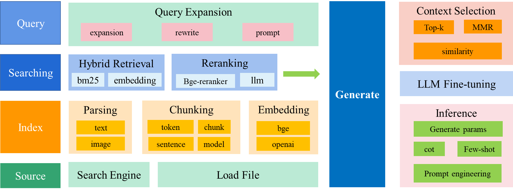

# open-rag
An open-source implementation of a Retrieval-Augmented Generation (RAG) system.

## Overview
This project implements a RAG system that combines the power of large language models with a retrieval mechanism to generate more accurate and contextually relevant responses.

## Features
- Document ingestion and processing
- Vector storage and retrieval
- Semantic search capabilities
- LLM integration for generation
- Configurable retrieval parameters

